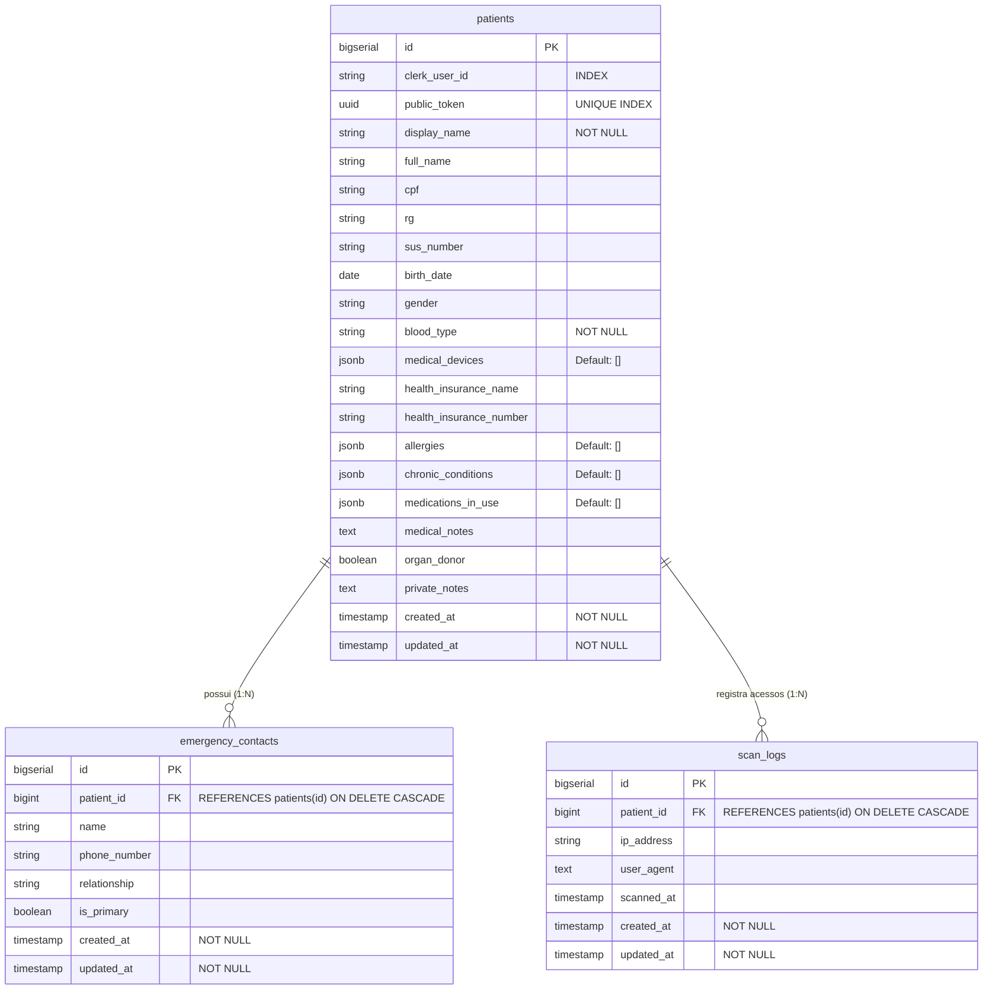

# Especificação Técnica do Backend - SOSqr (Rails 8 API RESTful)

Documento técnico de consolidação da arquitetura, modelagem de dados, regras de negócio, diretrizes de privacidade (LGPD), contratos de API e suíte de testes da API RESTful **SOSqr**.

---

## 1. Visão Geral e Arquitetura

### 1.1 Propósito do Sistema
O **SOSqr** é uma plataforma para gestão e visualização imediata de dados vitais e contatos de emergência via QR Code em cartão físico para qualquer indivíduo. O sistema provê uma API RESTful de alta performance, disponibilidade e estrita observância à privacidade para:
- Gerenciamento completo de prontuários médicos, dados vitais de emergência e contatos de socorro por cuidadores, familiares ou pelo próprio titular.
- Consulta instantânea e pública da ficha médica de socorro através da leitura de QR Code físico (em cartões padrão CR80, pulseiras ou chaveiros) por socorristas (SAMU, bombeiros, equipes de emergência e terceiros).
- Auditoria silenciosa de acessos a cada escaneamento de emergência com registro de IP e User-Agent (`scan_logs`).
- Painel administrativo com métricas agregadas e trilha de auditoria para monitoramento de saúde do ecossistema.
- Conformidade com a **LGPD (Lei Geral de Proteção de Dados - Lei nº 13.709/2018)**, balanceando a tutela da saúde e socorro imediato com o isolamento rigoroso de dados civis sensíveis contra fraudes.

### 1.2 Diagrama Arquitetural de Alto Nível

```mermaid
flowchart TD
    subgraph Frontend / Clientes
        A[Dashboard Cuidador / Web React]
        B[Socorrista / Leitor QR Code Mobile]
        ADM[Painel Administrativo / Web React]
    end

    subgraph Provedor de Identidade
        C[Clerk Auth Provider\n(RS256 JWT)]
    end

    subgraph Backend - sosqr-api Rails 8
        D[ApplicationController\nFiltro JWT RS256 & Extração de sub]
        D_ADMIN[Admin::BaseController\nValidação de Claim role: admin]
        E[Api::V1::PatientsController\nCRUD Autenticado do Cuidador]
        F[Api::V1::EmergencyProfilesController\nFicha Pública via public_token]
        G_ADMIN[Api::V1::Admin::DashboardController\nKPIs Agregados & Auditoria]
        H[ScanLog Recorder\nAuditoria Silenciosa de Leituras]
        I[(PostgreSQL 16+\nextensão pgcrypto)]
    end

    A -- "1. Login / Obter JWT" --> C
    A -- "2. Header: Authorization Bearer JWT" --> D
    D -- "3. Valida PEM & extrai sub" --> E
    E -- "4. CRUD isolado por clerk_user_id" --> I

    B -- "Leitura QR Code: GET /api/v1/emergency/:public_token" --> F
    F -- "Grava telemetria silenciosa" --> H
    H --> I
    F -- "Retorna dados vitais de socorro (LGPD Safe)" --> B

    ADM -- "1. Header: Bearer JWT com claim admin" --> D_ADMIN
    D_ADMIN -- "2. Verifica claim/role" --> G_ADMIN
    G_ADMIN -- "3. Consulta agregações e histórico" --> I
```

### 1.3 Stack Tecnológica

| Componente | Tecnologia | Versão / Detalhes | Justificativa Técnica |
| :--- | :--- | :--- | :--- |
| **Linguagem** | Ruby | `3.3.5` (`.ruby-version`) | Alta performance com YJIT e estabilidade moderna. |
| **Framework** | Ruby on Rails | `8.1.3` (Modo API) | `config.api_only = true`: elimina overhead de views/cookies/assets para latência mínima. |
| **Banco de Dados** | PostgreSQL | `16+` com `pgcrypto` | Suporte nativo a colunas `uuid` e tipos estruturados `jsonb`. |
| **Servidor de Aplicação**| Puma | `>= 5.0` | Servidor concorrente multithread de padrão industrial. |
| **Autenticação** | Clerk Auth | JWT assimétrico (RS256) | Delegação segura de autenticação sem armazenamento de senhas locais. |
| **Suíte de Testes** | RSpec & FactoryBot | `rspec-rails ~> 7.x`, `factory_bot_rails` | Testes automatizados BDD e mocks de integração declarativos. |

### 1.4 Dependências Críticas (`Gemfile`)

- **`jwt`**: Decodificação e validação criptográfica de tokens assimétricos RS256 emitidos pelo Clerk.
- **`dotenv-rails (~> 3.2)`**: Gerenciamento e injeção de variáveis de ambiente locais (`.env`) em desenvolvimento e testes.
- **`rack-cors`**: Configuração de Cross-Origin Resource Sharing liberando requisições assíncronas do frontend web/mobile.
- **`json (~> 2.8)`**: Compatibilidade de parsing JSON no ecossistema Rails 8 e Ruby 3.3.
- **`pg (~> 1.1)`**: Driver nativo do PostgreSQL para Active Record.

---

## 2. Autenticação, Segurança e Conformidade LGPD

### 2.1 Integração com Clerk Auth (RS256)
A autenticação de usuários e administradores é 100% stateless e baseada em tokens JWT assinados pelo provedor externo **Clerk**. Não há persistência de senhas ou hashes Bcrypt no banco de dados da API.

#### Fluxo de Validação no `ApplicationController`:
1. O cliente envia o token no cabeçalho HTTP:
   ```http
   Authorization: Bearer <clerk_session_jwt>
   ```
2. O filtro `authenticate_clerk_user!` intercepta todas as rotas privadas:
   - Extrai o token do cabeçalho. Caso ausente, responde imediatamente com `401 Unauthorized`.
   - Converte a chave pública PEM armazenada em `ENV['CLERK_PEM_PUBLIC_KEY']` em um objeto RSA (`OpenSSL::PKey::RSA.new`), tratando quebras de linha normalizadas (`\n`).
   - Executa `JWT.decode(token, rsa_public, true, { algorithm: 'RS256' })`.
   - Extrai a claim `sub` (Subject), que identifica univocamente o usuário no Clerk, atribuindo-a a `@current_user_id`.
   - Extrai eventuais claims de permissão (ex.: `role` ou `public_metadata.role`), atribuindo a `@current_user_role`.
   - Trata exceções `JWT::DecodeError`, `JWT::ExpiredSignature` (retornando `401 Unauthorized`) e `OpenSSL::PKey::RSAError` (retornando `500 Internal Server Error`).

```ruby
# app/controllers/application_controller.rb
class ApplicationController < ActionController::API
  before_action :authenticate_clerk_user!

  attr_reader :current_user_id, :current_user_role

  private

  def authenticate_clerk_user!
    header = request.headers['Authorization']
    token = header.split(' ').last if header.present?

    return render json: { error: 'Token não fornecido' }, status: :unauthorized unless token

    rsa_public = OpenSSL::PKey::RSA.new(ENV['CLERK_PEM_PUBLIC_KEY'].gsub('\n', "\n"))
    decoded = JWT.decode(token, rsa_public, true, { algorithm: 'RS256' })

    payload = decoded[0]
    @current_user_id = payload['sub']
    @current_user_role = payload['role'] || payload.dig('public_metadata', 'role')
  rescue JWT::DecodeError, JWT::ExpiredSignature
    render json: { error: 'Token inválido ou expirado' }, status: :unauthorized
  rescue OpenSSL::PKey::RSAError
    render json: { error: 'Erro na configuração da chave pública' }, status: :internal_server_error
  end
end
```

### 2.2 Proteção Anti-IDOR (Insecure Direct Object Reference)
O sistema implementa isolamento estrito de dados para mitigar qualquer risco de IDOR:

1. **Acesso Público de Emergência via UUID v4:**
   - O QR Code **nunca** expõe chaves sequenciais primárias (`/patients/1`, `/patients/2`).
   - O acesso é realizado estritamente pelo campo `public_token` (UUID v4 aleatório de 128 bits gerado via `SecureRandom.uuid`).
   - O espaço de endereçamento de $2^{122}$ combinações inviabiliza ataques de enumeração ou varredura em massa.
   - O campo conta com restrição de unicidade no banco de dados (`index_patients_on_public_token UNIQUE`).

2. **Isolamento de Escopo por Usuário/Cuidador nas Rotas Privadas:**
   - Nas operações autenticadas (`/api/v1/patients`), toda consulta é vinculada obrigatoriamente ao `@current_user_id` do token validado:
     ```ruby
     @patient = Patient.find_by!(id: params[:id], clerk_user_id: @current_user_id)
     ```
   - Caso um usuário tente acessar, editar ou excluir um `id` pertencente a outro usuário, a busca dispara `ActiveRecord::RecordNotFound`, respondendo `404 Not Found` sem revelar a existência do registro.

### 2.3 Diretriz de Privacidade e Conformidade LGPD
O sistema trata **Dados Pessoais Sensíveis** (Art. 5º, II da LGPD: saúde, biomédicos e diretivas) e **Dados Pessoais Civis** (Art. 5º, I: nome, CPF, RG).

Para cumprir os princípios de **Finalidade, Adequação e Necessidade** (Art. 6º, I, II e III da LGPD) combinados com a **Tutela da Saúde e Proteção da Vida** (Art. 7º, VII e Art. 11, II, "f" da LGPD), há uma divisão arquitetural estrita entre a ficha pública do socorrista e a ficha de gestão privada:

| Atributo do Modelo | Tipo de Dado | Exposto no QR Code de Emergência? | Exposto na Gestão do Usuário? | Justificativa Técnica e LGPD |
| :--- | :--- | :---: | :---: | :--- |
| `display_name` | Nome Social / Exibição | **Sim** | **Sim** | Identificação humanizada imediata no socorro. |
| `full_name` | Nome Civil Completo | **Sim** | **Sim** | Confirmação inequívoca da identidade civil do indivíduo pela equipe médica/socorrista. |
| `age` | Inteiro (método auxiliar) | **Sim** | **Sim** | Determinação imediata de dosagens e conduta médica apropriada à faixa etária. |
| `birth_date` | Data de Nascimento | **Sim** | **Sim** | Validação de prontuário hospitalar e confirmação etária. |
| `gender` | Gênero / Sexo | **Sim** | **Sim** | Direcionamento de protocolos clínicos no atendimento pré-hospitalar. |
| `blood_type` | Fator Sanguíneo | **Sim** | **Sim** | Dado vital emergencial para transfusão imediata em choque hemorrágico. |
| `medical_devices` | Lista (`jsonb`) | **Sim** | **Sim** | Alerta crítico para marcapasso (evita choque convencional), próteses e implantes. |
| `health_insurance_name` | Operadora do Convênio | **Sim** | **Sim** | Direcionamento ágil para hospital/pronto-socorro conveniado. |
| `health_insurance_number` | Matrícula do Convênio | **Sim** | **Sim** | Abertura ágil de ficha de urgência no hospital de destino. |
| `allergies` | Lista (`jsonb`) | **Sim** | **Sim** | Prevenção de choque anafilático fatal na administração de fármacos. |
| `chronic_conditions`| Lista (`jsonb`) | **Sim** | **Sim** | Orientação de conduta clínica (diabetes, cardiopatias, hipertensão, etc.). |
| `medications_in_use`| Lista (`jsonb`) | **Sim** | **Sim** | Prevenção de interações medicamentosas graves (anticoagulantes, insulina, sedativos). |
| `medical_notes` | Texto Livre | **Sim** | **Sim** | Recomendações clínicas emergenciais adicionais (alergias de contato, restrições). |
| `organ_donor` | Booleano | **Sim** | **Sim** | Expressão da diretiva antecipada de vontade do titular. |
| `emergency_contacts`| Sub-recurso (1:N) | **Sim** | **Sim** | Comunicação imediata com familiares e responsáveis durante o socorro. |
| `cpf` | Documento Federal | **NÃO** | **Sim** | **Protegido:** Previne fraudes financeiras, abertura indevida de contas e clonagem civil. |
| `rg` | Documento Estadual | **NÃO** | **Sim** | **Protegido:** Identificação civil mantida em sigilo estrito fora da emergência. |
| `sus_number` | Cartão Nacional SUS | **NÃO** | **Sim** | **Protegido:** Dado administrativo do prontuário do titular/cuidador. |
| `private_notes` | Anotações Privadas | **NÃO** | **Sim** | **Protegido:** Informações de rotina confidencial, nunca expostas no QR Code. |
| `clerk_user_id` | Identificador Auth | **NÃO** | **NÃO (interno)** | Chave interna de partição de dados do sistema. |

---

## 3. Modelagem de Dados e Esquema de Banco

### 3.1 Diagrama Entidade-Relacionamento (ERD)



### 3.2 Dicionário de Tabelas e Atributos

#### Tabela `patients`
Armazena o prontuário completo do indivíduo, dados vitais, dados civis restritos e parametrizações de socorro.

| Coluna | Tipo SQL | Modificadores / Índices | Descrição |
| :--- | :--- | :--- | :--- |
| `id` | `bigint` | Primary Key, Auto Increment | Identificador interno sequencial do paciente. |
| `clerk_user_id` | `varchar` | `index: true` | Identificador do usuário/cuidador no Clerk (claim `sub`). |
| `public_token` | `uuid` | `unique: true`, `index: true` | Token público UUID v4 impresso no QR Code de emergência. |
| `display_name` | `varchar` | `null: false` | Nome de exibição/social (fallback automático via callback). |
| `full_name` | `varchar` | Opcional | Nome civil completo do titular. |
| `cpf` | `varchar` | Opcional | CPF do titular (restrito ao usuário/cuidador autenticado). |
| `rg` | `varchar` | Opcional | Registro Geral civil e órgão emissor. |
| `sus_number` | `varchar` | Opcional | Cartão Nacional de Saúde (CNS/SUS). |
| `birth_date` | `date` | Opcional | Data de nascimento (utilizada no cálculo do método `age`). |
| `gender` | `varchar` | Opcional | Gênero/sexo (`Feminino`, `Masculino`, etc.). |
| `blood_type` | `varchar` | `null: false` | Tipo sanguíneo e fator Rh (`A+`, `O-`, etc.). |
| `medical_devices` | `jsonb` | `default: []` | Lista de dispositivos, próteses ou implantes (ex.: Marcapasso). |
| `health_insurance_name` | `varchar` | Opcional | Nome da operadora do plano de saúde/convênio. |
| `health_insurance_number` | `varchar` | Opcional | Número da carteirinha ou matrícula do plano de saúde. |
| `allergies` | `jsonb` | `default: []` | Array JSON de alergias medicamentosas e alimentares. |
| `chronic_conditions`| `jsonb` | `default: []` | Array JSON de condições crônicas preexistentes. |
| `medications_in_use`| `jsonb` | `default: []` | Array JSON de medicamentos de uso contínuo e posologias. |
| `medical_notes` | `text` | Opcional | Observações clínicas vitais adicionais para socorristas. |
| `organ_donor` | `boolean` | Opcional | Declaração de doador de órgãos. |
| `private_notes` | `text` | Opcional | Informações confidenciais de acesso exclusivo ao titular/cuidador. |
| `created_at` | `timestamp` | `null: false` | Timestamp de criação do registro. |
| `updated_at` | `timestamp` | `null: false` | Timestamp da última atualização. |

#### Tabela `emergency_contacts`
Contatos telefônicos de familiares ou responsáveis a serem acionados em caso de resgate.

| Coluna | Tipo SQL | Modificadores / Índices | Descrição |
| :--- | :--- | :--- | :--- |
| `id` | `bigint` | Primary Key, Auto Increment | Identificador interno do contato. |
| `patient_id` | `bigint` | Foreign Key `patients(id)`, `null: false`, `index: true` | Referência ao paciente proprietário do contato. |
| `name` | `varchar` | Opcional | Nome da pessoa de contato. |
| `phone_number` | `varchar` | Opcional | Número de telefone/WhatsApp com DDD. |
| `relationship` | `varchar` | Opcional | Grau de parentesco/vínculo (ex: "Filho(a)", "Cônjuge", "Médico(a)"). |
| `is_primary` | `boolean` | Opcional | Define se é o contato prioritário de acionamento imediato. |
| `created_at` | `timestamp` | `null: false` | Timestamp de criação. |
| `updated_at` | `timestamp` | `null: false` | Timestamp de atualização. |

#### Tabela `scan_logs`
Trilha de auditoria e telemetria gravada a cada leitura da ficha de emergência.

| Coluna | Tipo SQL | Modificadores / Índices | Descrição |
| :--- | :--- | :--- | :--- |
| `id` | `bigint` | Primary Key, Auto Increment | Identificador interno do log de leitura. |
| `patient_id` | `bigint` | Foreign Key `patients(id)`, `null: false`, `index: true` | Referência ao paciente escaneado. |
| `ip_address` | `varchar` | Opcional | Endereço IP do socorrista no momento do scan. |
| `user_agent` | `text` | Opcional | Header `User-Agent` (dispositivo/browser utilizado na leitura). |
| `scanned_at` | `timestamp` | Opcional | Data e hora exata da leitura do QR Code. |
| `created_at` | `timestamp` | `null: false` | Timestamp de inserção no banco. |
| `updated_at` | `timestamp` | `null: false` | Timestamp de atualização. |

---

### 3.3 Regras de Negócio e Implementação nos Modelos

#### `Patient` (`app/models/patient.rb`)
- **Associações em Cascata**:
  - `has_many :emergency_contacts, dependent: :destroy`
  - `has_many :scan_logs, dependent: :destroy`
- **Atributos Aninhados (Nested Attributes)**:
  - `accepts_nested_attributes_for :emergency_contacts, allow_destroy: true` — permite criação, edição e exclusão de contatos em uma única transação atômica.
- **Callbacks do Ciclo de Vida**:
  - `before_validation :ensure_display_name`: caso `display_name` seja omitido, extrai automaticamente o primeiro nome a partir de `full_name` (`full_name.to_s.strip.split(/\s+/).first`).
  - `before_create :set_public_token`: inicializa o `public_token` usando `SecureRandom.uuid` se o atributo estiver vazio.
- **Métodos Auxiliares**:
  - `age`: Calcula dinamicamente a idade em anos inteiros com base em `birth_date` e `Date.current`, ajustando para o mês e dia de aniversário:
    ```ruby
    def age
      return nil if birth_date.blank?
      b_date = birth_date.is_a?(Date) ? birth_date : Date.parse(birth_date.to_s)
      today = Date.current
      calculated = today.year - b_date.year
      calculated -= 1 if today.month < b_date.month || (today.month == b_date.month && today.day < b_date.day)
      calculated
    rescue ArgumentError
      nil
    end
    ```
  - `last_scan`: Retorna os dados do último escaneamento associado a partir de `scan_logs`:
    ```ruby
    def last_scan
      last_log = scan_logs.max_by { |s| s.scanned_at || s.created_at }
      return nil unless last_log

      timestamp = last_log.scanned_at || last_log.created_at
      formatted = timestamp&.strftime("%d/%m/%Y %H:%M")
      {
        date: formatted,
        scanned_at: formatted,
        ip_address: last_log.ip_address,
        ip: last_log.ip_address
      }
    end
    ```
- **Validações**:
  - `validates :display_name, :blood_type, presence: true` assegura integridade mínima para situações de socorro.

#### `EmergencyContact` (`app/models/emergency_contact.rb`)
- **Associações**:
  - `belongs_to :patient`

#### `ScanLog` (`app/models/scan_log.rb`)
- **Associações**:
  - `belongs_to :patient`

---

## 4. Contratos e Especificação de Endpoints

### 4.1 Resumo dos Endpoints

| Método | Caminho | Autenticação / Permissão | Descrição | Status de Sucesso |
| :--- | :--- | :---: | :--- | :---: |
| `GET` | `/api/v1/emergency/:public_token` | **Pública** | Ficha vital de emergência (socorrista). Gera `ScanLog`. | `200 OK` |
| `GET` | `/api/v1/patients` | Bearer JWT (Usuário) | Lista perfis vinculados ao usuário logado com `age` e `last_scan`. | `200 OK` |
| `GET` | `/api/v1/patients/:id` | Bearer JWT (Usuário) | Prontuário detalhado com dados civis, médicos e contatos. | `200 OK` |
| `POST` | `/api/v1/patients` | Bearer JWT (Usuário) | Cadastra perfil com contatos aninhados e campos médicos. | `201 Created` |
| `PATCH/PUT` | `/api/v1/patients/:id` | Bearer JWT (Usuário) | Atualiza prontuário e contatos com suporte a `_destroy`. | `200 OK` |
| `DELETE` | `/api/v1/patients/:id` | Bearer JWT (Usuário) | Exclui perfil com deleção em cascata (`dependent: :destroy`). | `204 No Content` |
| `GET` | `/api/v1/admin/dashboard` | Bearer JWT (Role `admin`) | Agregações do sistema (KPIs) e histórico de 50 scans. | `200 OK` |

---

### 4.2 Detalhamento das Rotas

#### 4.2.1 `GET /api/v1/emergency/:public_token`
- **Descrição**: Rota pública acionada pelo socorrista ao ler o QR Code físico. Retorna estritamente dados médicos vitais de socorro e contatos para discagem rápida. Dispara a gravação silenciosa de auditoria em `scan_logs`.
- **Autenticação**: Nenhuma (`skip_before_action :authenticate_clerk_user!`).
- **Parâmetros de Rota**:
  - `public_token` (UUID v4 obrigatório): Token contido na URL do QR Code.
- **Efeito Colateral**: Insere um registro em `scan_logs` com `ip_address: request.remote_ip`, `user_agent: request.user_agent`, `scanned_at: Time.current`.
- **Respostas**:

##### 200 OK
```json
{
  "public_token": "cb11872a-8338-4119-8ca6-f14f7b77aace",
  "display_name": "Francisca",
  "full_name": "Maria Francisca dos Santos",
  "age": 42,
  "birth_date": "1984-05-10",
  "gender": "Feminino",
  "blood_type": "O+",
  "organ_donor": true,
  "medical_notes": "Alergia severa a dipirona e anti-inflamatórios não-esteroidais.",
  "medical_devices": [
    "Marcapasso Cardíaco (Não desfibrilar convencionalmente)"
  ],
  "health_insurance_name": "Unimed Fortaleza",
  "health_insurance_number": "123456789-0",
  "allergies": [
    "Penicilina e Dipirona"
  ],
  "chronic_conditions": [
    "Hipertensão Arterial",
    "Diabetes Tipo 2"
  ],
  "medications_in_use": [
    "Losartana 50mg"
  ],
  "emergency_contacts": [
    {
      "name": "Carlos",
      "phone_number": "(85) 99123-4567",
      "relationship": "Irmão",
      "is_primary": true
    },
    {
      "name": "Mariana",
      "phone_number": "(85) 99234-5678",
      "relationship": "Esposa",
      "is_primary": false
    }
  ]
}
```

##### 404 Not Found (Token inexistente ou inválido)
```json
{
  "error": "Ficha de emergência não encontrada"
}
```

---

#### 4.2.2 `GET /api/v1/patients`
- **Descrição**: Retorna a lista de perfis vinculados exclusivamente ao usuário autenticado (`clerk_user_id == current_user_id`). Inclui o cálculo de idade (`age`), contatos de emergência e o resumo do último escaneamento (`last_scan`).
- **Autenticação**: Obrigatória (`Authorization: Bearer <token>`).
- **Respostas**:

##### 200 OK
```json
[
  {
    "id": 1,
    "clerk_user_id": "user_2testClerkId123",
    "public_token": "cb11872a-8338-4119-8ca6-f14f7b77aace",
    "display_name": "Francisca",
    "full_name": "Maria Francisca dos Santos",
    "cpf": "123.456.789-00",
    "rg": "1234567 SSP/CE",
    "sus_number": "898001234567890",
    "birth_date": "1984-05-10",
    "age": 42,
    "gender": "Feminino",
    "blood_type": "O+",
    "medical_devices": [
      "Marcapasso Cardíaco (Não desfibrilar convencionalmente)"
    ],
    "health_insurance_name": "Unimed Fortaleza",
    "health_insurance_number": "123456789-0",
    "allergies": ["Penicilina e Dipirona"],
    "chronic_conditions": ["Hipertensão Arterial"],
    "medications_in_use": ["Losartana 50mg"],
    "medical_notes": "Alergia severa a dipirona.",
    "organ_donor": true,
    "private_notes": "Chave reserva na portaria.",
    "created_at": "2026-09-14T10:00:00.000Z",
    "updated_at": "2026-09-14T10:00:00.000Z",
    "emergency_contacts": [
      {
        "id": 1,
        "patient_id": 1,
        "name": "Carlos",
        "phone_number": "(85) 99123-4567",
        "relationship": "Irmão",
        "is_primary": true,
        "created_at": "2026-09-14T10:00:00.000Z",
        "updated_at": "2026-09-14T10:00:00.000Z"
      }
    ],
    "last_scan": {
      "date": "14/09/2026 09:12",
      "scanned_at": "14/09/2026 09:12",
      "ip_address": "191.209.45.12",
      "ip": "191.209.45.12"
    }
  }
]
```

##### 401 Unauthorized (Token ausente ou inválido)
```json
{
  "error": "Token não fornecido"
}
```

---

#### 4.2.3 `GET /api/v1/patients/:id`
- **Descrição**: Retorna o prontuário completo de um perfil específico pertencente ao usuário autenticado.
- **Autenticação**: Obrigatória (`Authorization: Bearer <token>`).
- **Parâmetros de Rota**: `id` (bigint).
- **Respostas**:
  - `200 OK`: Retorna o objeto individual com a mesma estrutura de atributos civis e médicos de `GET /api/v1/patients`, incluindo `emergency_contacts`, `age` e `last_scan`.
  - `404 Not Found`:
    ```json
    {
      "error": "Paciente não encontrado ou acesso não autorizado"
    }
    ```

---

#### 4.2.4 `POST /api/v1/patients`
- **Descrição**: Cadastra um novo perfil, associando-o automaticamente ao `@current_user_id` e gerando seu `public_token` UUID v4. Suporta atributos aninhados de contatos de emergência (`emergency_contacts_attributes`) e os campos médicos/civis consolidados.
- **Autenticação**: Obrigatória (`Authorization: Bearer <token>`).
- **Cabeçalhos**: `Content-Type: application/json`.
- **Exemplo de Payload de Requisição**:
```json
{
  "patient": {
    "display_name": "Geraldo",
    "full_name": "Geraldo Alencar da Silva",
    "cpf": "987.654.321-11",
    "rg": "7654321 SSP/RJ",
    "sus_number": "700001234567890",
    "birth_date": "1985-11-20",
    "gender": "Masculino",
    "blood_type": "AB-",
    "organ_donor": false,
    "medical_devices": [
      "Aparelho auditivo bilateral"
    ],
    "health_insurance_name": "Bradesco Saúde",
    "health_insurance_number": "987654321",
    "allergies": [
      "Iodo",
      "Sulfas"
    ],
    "chronic_conditions": [
      "Asma"
    ],
    "medications_in_use": [
      "Salbutamol spray"
    ],
    "medical_notes": "Portador de asma moderada.",
    "private_notes": "Informações confidenciais.",
    "emergency_contacts_attributes": [
      {
        "name": "Ana Luiza",
        "phone_number": "+5521977776666",
        "relationship": "Esposa",
        "is_primary": true
      }
    ]
  }
}
```

- **Respostas**:
  - `201 Created`: Retorna o objeto do perfil cadastrado com `id`, `public_token`, `created_at` e `updated_at`.
  - `422 Unprocessable Entity`: Erros de validação (ex.: `Display name não pode ficar em branco`, `Blood type não pode ficar em branco`).

---

#### 4.2.5 `PATCH/PUT /api/v1/patients/:id`
- **Descrição**: Atualiza os dados cadastrais e médicos do perfil. Permite adicionar contatos (sem `id`), atualizar contatos existentes (passando `id`) ou remover contatos passando `id` e `_destroy: true`.
- **Autenticação**: Obrigatória (`Authorization: Bearer <token>`).
- **Respostas**:
  - `200 OK`: Retorna o objeto atualizado.
  - `422 Unprocessable Entity`: Falhas de validação.
  - `404 Not Found`: Caso o perfil não pertença ao usuário logado.

---

#### 4.2.6 `DELETE /api/v1/patients/:id`
- **Descrição**: Exclui o perfil do sistema, removendo em cascata todos os contatos de emergência e logs de escaneamento associados via `dependent: :destroy`.
- **Autenticação**: Obrigatória (`Authorization: Bearer <token>`).
- **Respostas**:
  - `204 No Content`: Exclusão executada com sucesso.
  - `404 Not Found`: Registro inexistente ou pertencente a outro usuário.

---

#### 4.2.7 `GET /api/v1/admin/dashboard` (Módulo Administrativo Planejado)
- **Descrição**: Endpoint exclusivo para administradores da plataforma. Retorna KPIs agregados de monitoramento do sistema e a listagem dos últimos 50 escaneamentos de emergência auditados.
- **Autenticação**: Obrigatória via Bearer JWT.
- **Autorização**: Validação da claim `role == 'admin'` ou `public_metadata.role == 'admin'`. Retorna `403 Forbidden` se o usuário logado não possuir privilégios administrativos.
- **Exemplo de Resposta `200 OK`**:
```json
{
  "kpis": {
    "total_patients": 128,
    "total_scans": 1450,
    "total_caregivers": 94
  },
  "recent_scans": [
    {
      "id": 542,
      "patient_id": 1,
      "patient_name": "Maria Francisca dos Santos",
      "public_token": "cb11872a-8338-4119-8ca6-f14f7b77aace",
      "ip_address": "191.209.45.12",
      "user_agent": "Mozilla/5.0 (iPhone; CPU iPhone OS 17_4 like Mac OS X)",
      "scanned_at": "2026-09-21T08:15:30.000Z"
    }
  ]
}
```

- **Exemplo de Resposta `403 Forbidden`**:
```json
{
  "error": "Acesso negado: recurso exclusivo para administradores"
}
```

---

## 5. Auditoria e Logs de Emergência (`ScanLog`)

### 5.1 Fluxo de Gravação Silenciosa
A cada requisição no endpoint público `GET /api/v1/emergency/:public_token`, a aplicação grava um registro de auditoria antes da resposta:

```ruby
# app/controllers/api/v1/emergency_profiles_controller.rb
patient = Patient.includes(:emergency_contacts).find_by!(public_token: params[:public_token])

patient.scan_logs.create(
  ip_address: request.remote_ip,
  user_agent: request.user_agent,
  scanned_at: Time.current
)
```

### 5.2 Propósitos e Benefícios da Telemetria
1. **Rastreabilidade e Segurança Jurídica**: Permite auditar quando, em qual horário e de qual IP a ficha foi consultada.
2. **Notificação em Tempo Real (Solid Queue)**: Na evolução de mensageria assíncrona, a gravação servirá como evento/trigger para disparar alertas aos contatos prioritários (WhatsApp/SMS/Push: *"Atenção: A ficha de emergência de Maria Francisca acaba de ser acessada por um socorrista"*).
3. **Detecção de Anomalias e Scraping**: Identificação de acessos repetitivos ou tentativas de força bruta em tokens públicos.

---

## 6. Ambiente de Testes (RSpec)

### 6.1 Configuração do RSpec e FactoryBot
A suíte de testes utiliza `rspec-rails` com `FactoryBot::Syntax::Methods` habilitado globalmente em `spec/rails_helper.rb`.

#### Factory de Paciente Atualizada (`spec/factories/patients.rb`):
```ruby
FactoryBot.define do
  factory :patient do
    clerk_user_id { "user_test_#{SecureRandom.hex(4)}" }
    display_name { "Francisca" }
    full_name { "Maria Francisca dos Santos" }
    cpf { "123.456.789-00" }
    rg { "1234567 SSP/CE" }
    birth_date { "1984-05-10" }
    gender { "Feminino" }
    blood_type { "O+" }
    organ_donor { true }
    medical_devices { ["Marcapasso Cardíaco"] }
    health_insurance_name { "Unimed Fortaleza" }
    health_insurance_number { "123456789-0" }
    allergies { ["Penicilina e Dipirona"] }
    chronic_conditions { ["Hipertensão Arterial"] }
    medications_in_use { ["Losartana 50mg"] }
    medical_notes { "Alergia severa a dipirona." }
    private_notes { "Chave reserva na portaria." }
  end
end
```

---

## 7. Variáveis de Ambiente e Configuração

O backend requer as seguintes variáveis configuradas no arquivo `.env` (ou no ambiente de container/produção):

```bash
# Banco de Dados PostgreSQL
DATABASE_HOST=localhost
DATABASE_PORT=5432
DATABASE_USERNAME=postgres
DATABASE_PASSWORD=postgres
SOSQR_API_DATABASE=sosqr_api_development

# Autenticação Clerk (Chave Pública PEM obtida no dashboard do Clerk)
CLERK_PEM_PUBLIC_KEY="-----BEGIN PUBLIC KEY-----\nMIIBIjANBgkqhkiG9w0BAQEFAAOCAQ8AMIIBCgKCAQEA...\n-----END PUBLIC KEY-----"

# Ambiente Rails
RAILS_ENV=development
PORT=3000
```

---

## 8. Evolução Arquitetural e Roadmap

1. **Background Jobs com Solid Queue (Rails 8)**: Desacoplar a gravação de `ScanLog` do ciclo síncrono da requisição HTTP pública para garantir latência de resposta $< 40$ms.
2. **Mensageria e Notificações de Resgate**: Disparo assíncrono de notificações de emergência (SMS/WhatsApp/Push) aos contatos primários cadastrados no momento da leitura do QR Code.
3. **Rate Limiting com `Rack::Attack`**: Proteção contra abusos, scripts de varredura e negação de serviço (DoS) nas rotas públicas `/emergency/:public_token`.
4. **Webhooks do Clerk**: Sincronização automática para expurgo ou anonimização de prontuários caso a conta seja encerrada (Art. 18, VI da LGPD).
