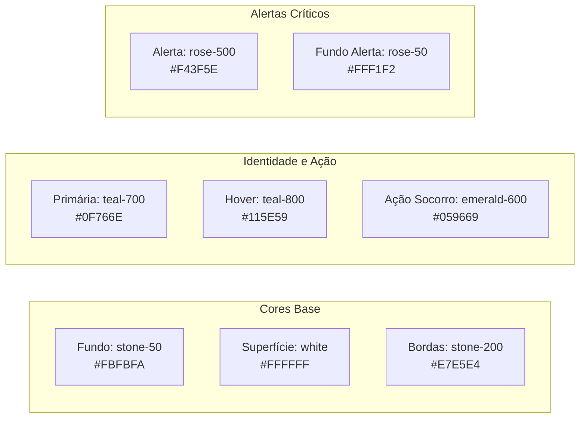
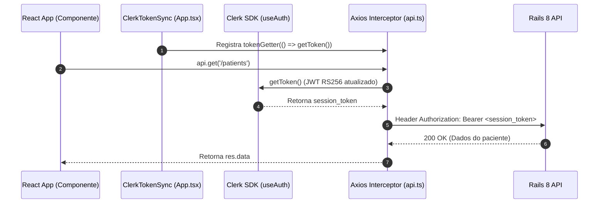

# Especificação Técnica do Frontend - SOSqr (React + Vite + TypeScript)

Documento técnico de consolidação da arquitetura, Design System ("Cuidado Suave"), conformidade de acessibilidade (WCAG AAA), contratos de interface, rotas, telas e suíte de testes da aplicação web e mobile **SOSqr**.

---

## 1. Visão Geral e Arquitetura

### 1.1 Propósito da Aplicação
O **SOSqr Frontend** é uma plataforma para gestão e visualização imediata de dados vitais e contatos de emergência via QR Code em cartão físico para qualquer indivíduo. É uma Single Page Application (SPA) responsiva e mobile-first, projetada com foco duplo:
1. **Acolhimento ao Usuário/Familiar/Cuidador**: Interface intuitiva, serena e segura para cadastrar dados vitais, acompanhar leituras do QR Code e gerar o cartão físico de emergência.
2. **Eficiência para Socorristas e Emergência**: Ficha médica pública de carregamento instantâneo, legível sob luz solar direta, com destaque crítico imediato para tipo sanguíneo, alergias severas e medicamentos de alto risco, além de discagem telefônica direta com 1 toque para os responsáveis.

### 1.2 Stack Tecnológica Consolidada

| Tecnologia | Versão | Propósito / Justificativa Técnica |
| :--- | :--- | :--- |
| **React** | `19.2.x` / `18+` | Biblioteca central de UI com ciclo de renderização concorrente e alta reatividade. |
| **Vite** | `8.3.x` | Build tool e dev server ultra-rápido baseado em ES modules nativos. |
| **TypeScript** | `5.8.x` / `6.x` | Tipagem estática rigorosa (`strict: true`), prevenindo bugs em tempo de compilação. |
| **Tailwind CSS** | `3.4.x` | Estilização utilitária com Design System customizado e zero overhead de runtime CSS. |
| **@clerk/clerk-react** | `5.61.x` | Autenticação gerenciada, emissão de JWT RS256 e proteção de rotas sem senhas locais. |
| **Axios** | `1.20.x` | Cliente HTTP com interceptors para injeção do Bearer Token do Clerk e tratamento de erros. |
| **qrcode.react** | `4.2.x` | Geração de QR Code vetorial (`QRCodeSVG`) e canvas oculto para extração de PNG a 300 DPI. |
| **@react-pdf/renderer**| `4.9.x` | Renderização e exportação de PDF vetorial do cartão físico CR80 (client-side) a 300 DPI. |
| **lucide-react** | `1.47.x` | Iconografia consistente, leve e semanticamente acessível. |
| **react-router-dom** | `7.x` / `6.x` | Roteamento declarativo com separação entre rotas públicas e protegidas. |
| **Vitest & RTL** | `5.0.x` / `16.3.x` | Suíte de testes unitários e de integração com simulação de DOM (`jsdom`). |

---

## 2. Design System: "Cuidado Suave"

### 2.1 Filosofia Visual
A estética "Cuidado Suave" rejeita a frieza hospitalar tradicional em favor de uma experiência acolhedora, serena e humana. Utiliza tons terrosos suaves (`stone`), verde-azulado tranquilizador (`teal`) e contrastes certificados, transmitindo segurança sem gerar ansiedade.



### 2.2 Paleta de Cores Oficial (`tailwind.config.js`)

| Token Tailwind | Hex Code | Aplicação / Semântica |
| :--- | :--- | :--- |
| `stone-50` | `#FBFBFA` | Fundo geral da aplicação e páginas de login. |
| `white` | `#FFFFFF` | Superfície dos cards, modais e containers de dados. |
| `stone-100` | `#F5F5F4` | Fundos secundários, inputs desabilitados e chips neutros. |
| `stone-200` | `#E7E5E4` | Bordas sutis, divisores e linhas de separação estrutural. |
| `stone-600` | `#57534E` | Textos secundários, legendas, rótulos auxiliares e metadados. |
| `stone-900` | `#1C1917` | Texto principal, títulos e valores médicos de alto contraste. |
| `teal-50` | `#F0FDFA` | Fundo de destaque suave para badges e seleção de texto. |
| `teal-700` | `#0F766E` | Cor primária institucional, botões principais e ícones ativos. |
| `teal-800` | `#115E59` | Estado hover e active de botões primários. |
| `rose-50` | `#FFF1F2` | Fundo de destaque para caixas de alerta crítico (alergias, tipo sanguíneo). |
| `rose-200` | `#FECDD3` | Borda de contenção para blocos de alerta médico. |
| `rose-500` | `#F43F5E` | Destaque crítico de perigo vital (choque anafilático, incompatibilidade). |
| `emerald-600` | `#059669` | Ação imediata de socorro (botões de discagem rápida `tel:` e salvamento). |
| `emerald-700` | `#047857` | Estado hover de botões de socorro. |

#### Cores de Impressão do Cartão Físico CR80:
- **Barra Superior de Emergência**: `#0B6651` (Verde escuro de alta legibilidade).
- **Fundo do Cartão**: `#F3EFE6` (Creme suave de alta durabilidade e contraste visual).
- **Borda de Contenção**: `#D6D3D1`.

---

### 2.3 Tipografia
O SOSqr adota uma estratégia tipográfica estritamente orientada à acessibilidade visual:

```javascript
fontFamily: {
  sans: ['"Atkinson Hyperlegible"', '"Plus Jakarta Sans"', 'sans-serif'],
}
```

1. **Atkinson Hyperlegible (Braille Institute)**:
   - Projetada especificamente para pessoas com baixa acuidade visual ou condições oculares adversas.
   - Distinção nítida entre caracteres facilmente confundíveis (como número `0` e letra `O`, número `1`, letra `l` minúscula e letra `I` maiúscula).
   - Utilizada em todos os dados médicos vitais, nomes, dosagens e números de telefone de emergência.
2. **Plus Jakarta Sans**:
   - Tipografia de suporte para textos institucionais, cabeçalhos administrativos e tabelas.

---

### 2.4 Acessibilidade (WCAG 2.1 AAA) e Ergonomia Mobile
- **Contraste de Luz Solar Direta (WCAG AAA)**: Textos e indicadores de socorro mantêm contraste superior a `7:1` para texto normal e `4.5:1` para texto grande, garantindo leitura sob sol forte em vias públicas.
- **Alvos de Toque (Touch Targets)**: Todos os botões, switches e links interativos possuem dimensões mínimas entre **48px e 56px**, acomodando tremores motores e socorristas utilizando luvas de procedimento.
- **Semântica ARIA**: Uso de roles explícitos (`role="switch"`, `aria-checked`, `aria-label`, headings hierárquicos `h1`-`h4`).
- **Nenhum Dado Vital Oculto por Accordion**: Na ficha pública de emergência, todos os dados críticos são renderizados abertos por padrão para evitar que o socorrista perca segundos preciosos tentando expandir seções.

---

## 3. Arquitetura de Diretórios do Frontend

A estrutura em `frontend/sosqr-web/src` organiza-se por camadas de domínio, componentes e utilitários:

```
frontend/sosqr-web/src/
├── assets/                 # Recursos estáticos e imagens
├── components/             # Componentes globais compartilhados
│   ├── DeletePatientModal.tsx  # Modal de confirmação segura de exclusão
│   └── ...
├── features/               # Módulos verticais de domínio
│   ├── auth/               # Customização e wrappers de autenticação Clerk
│   ├── card-issue/         # Emissão de cartão físico CR80
│   │   ├── pdf/
│   │   │   └── EmergencyCardDocument.tsx  # Documento vetorial @react-pdf/renderer
│   ├── emergency-profile/  # Componentes da ficha pública de socorro
│   └── patients/           # Gestão de perfis e prontuários
│       ├── components/
│       │   └── PatientCard.tsx       # Card de perfil no dashboard
│       ├── types/
│       │   └── index.ts              # Interfaces do domínio de pacientes
├── layouts/
│   └── DashboardLayout.tsx # Layout privado com header, avatar e navegação
├── pages/                  # Páginas conectadas às rotas
│   ├── CardIssuePage.tsx        # Emissão e preview do Cartão CR80
│   ├── DashboardPage.tsx        # Painel de Perfis
│   ├── EmergencyProfilePage.tsx # Ficha pública mobile-first (/emergency/:token)
│   ├── PatientFormPage.tsx      # Formulário em 3 colunas (criação e edição)
│   └── AdminDashboardPage.tsx   # Painel analítico de administração
├── services/
│   └── api.ts              # Instância Axios com interceptor de JWT Clerk
├── types/
│   └── index.ts            # Tipos e enums transversais (BloodType, etc.)
├── utils/
│   ├── calculateAge.ts     # Cálculo de idade inteira
│   ├── cpf.ts              # Formatação e validação algorítmica de CPF (Módulo 11)
│   └── validateCpf.ts      # Validador desacoplado para testes
├── App.tsx                 # Roteador central e sincronizador de tokens
├── main.tsx                # Entrada React com ClerkProvider
└── index.css               # Importação de fontes e diretivas Tailwind
```

---

## 4. Estrutura de Rotas e Telas Detalhada

### 4.1 Resumo do Mapa de Rotas

| Rota | Acesso | Componente / Tela | Descrição |
| :--- | :---: | :--- | :--- |
| `/login/*` | Público | `<SignIn />` (Clerk) | Autenticação com identidade visual SOSqr. |
| `/cadastro/*` | Público | `<SignUp />` (Clerk) | Criação de conta. |
| `/emergency/:public_token` | **Público** | `EmergencyProfilePage` | Ficha pública vital de resgate (suporta `:public_token = demo`). |
| `/` ou `/dashboard` | Autenticado | `DashboardPage` | Painel de Perfis: listagem, auditoria de scans e atalhos rápidos. |
| `/pacientes/novo` | Autenticado | `PatientFormPage` | Cadastro de perfil em grid de 3 colunas temáticas. |
| `/pacientes/:id/editar` | Autenticado | `PatientFormPage` | Edição completa de prontuário e contatos com remoção segura. |
| `/pacientes/:id/cartao` | Autenticado | `CardIssuePage` | Emissão de cartão CR80, visualização interativa e PDF 300 DPI. |
| `/admin` | Restrito (`role: admin`) | `AdminDashboardPage` | Monitoramento global, KPIs e histórico dos últimos 50 scans. |

---

### 4.2 Detalhamento de Cada Tela

#### 1. `/login/*` e `/cadastro/*` (Telas de Autenticação)
- **Tecnologia**: Componentes `<SignIn />` e `<SignUp />` da biblioteca `@clerk/clerk-react`.
- **Estilização**:
  - Fundo em `stone-50` com seleção em `teal-50`/`teal-800`.
  - Cabeçalho superior com badge institucional: ícone `HeartHandshake` em fundo `teal-700`, texto "SOSqr" e subtítulo "Acesso do Cuidador".
- **Comportamento**:
  - Redirecionamento automático pós-autenticação para `/dashboard`.
  - Link recíproco entre login e cadastro.

---

#### 2. `/emergency/:public_token` (Ficha Pública de Emergência)
- **Objetivo**: Atendimento pré-hospitalar e socorro imediato por profissionais do SAMU, bombeiros ou transeuntes.
- **Design & Layout**:
  - **100% Mobile-First e Autônoma**: Sem barra de navegação do sistema, menus ou botões de login para focar exclusivamente no resgate.
  - **Consumo de API**: `GET /api/v1/emergency/:public_token` (chamada assíncrona pública sem Bearer Token).
  - **Ambiente de Demonstração**: Acesso à URL `/emergency/demo` carrega automaticamente dados completos de teste (`DEMO_PROFILE`) sem depender do backend.
- **Blocos Visuais**:
  1. **Cabeçalho de Emergência**:
     - Banner superior: `SOSqr | FICHA PÚBLICA DE EMERGÊNCIA`.
     - Nome civil completo e nome social/exibição em destaque tipográfico Atkinson.
     - Idade em anos e data de nascimento formatada (`DD/MM/AAAA`).
  2. **Bloco de Alerta Crítico (Destaque Imediato)**:
     - Caixa de alerta com fundo `rose-50` e borda `rose-200`.
     - **Tipo Sanguíneo Gigante**: Exibição em caixa alta com fator Rh textual (ex.: `O+ (Positivo)`).
     - **Selo de Doador de Órgãos**: Badge indicativo da vontade expressa.
     - **Alergias Medicamentosas / Alimentares**: Tags vermelhas destacadas (ex.: "Penicilina e Dipirona").
     - **Medicamentos de Alto Risco**: Destaque para anticoagulantes, insulina ou psicotrópicos (ex.: "Rivaroxabana (Xarelto) e Insulina").
  3. **Bloco Clínico Completo**:
     - **Condições Crônicas**: Chips destacados para hipertensão, diabetes, asma, etc.
     - **Dispositivos Médicos e Implantes**: Alertas para marcapasso cardíaco (com aviso: "Não desfibrilar convencionalmente"), próteses ou aparelhos auditivos.
     - **Convênio de Saúde**: Operadora e número de matrícula hospitalar.
     - **Observações Médicas Extras (`medical_notes`)**: Textarea livre destacando restrições clínicas, alergias de contato ou histórico de quedas.
  4. **Rodapé Fixo de Socorro (Sticky Footer)**:
     - Botões em largura total com cor de ação `emerald-600` e link direto `tel:<numero>`.
     - Discagem com 1 único toque para o contato prioritário e contatos secundários.
  5. **Nota de Privacidade**:
     - `Dados de emergência públicos protegidos (LGPD) • SOSqr`

---

#### 3. `/dashboard` (Painel de Perfis)
- **Objetivo**: Gestão centralizada dos perfis sob responsabilidade do usuário autenticado.
- **Componentes e Funcionalidades**:
  - **Título e Subtítulo**: **"Painel de Perfis"** e **"Gestão de fichas vitais e cartões de emergência"**.
  - **Listagem de Perfis**: Cards modulares (`PatientCard`) com foto/avatar, iniciais, idade calculada dinamicamente e tipo sanguíneo.
  - **Linha do Último Escaneamento**:
    - Indicador de data/hora formatada e endereço IP do socorrista que realizou a leitura do QR Code.
    - Badge discreto "Nenhum escaneamento registrado" caso nunca tenha sido lido.
  - **Ações Rápidas por Perfil**:
    - **Botão QR Code**: Abre modal limpo exibindo o QR Code gerado em SVG em alta definição, sem expor hashes feios ou URLs longas na listagem principal. Possui atalho para copiar o link direto da ficha e atalho para a tela de emissão de cartão físico.
    - **Ver Ficha Pública**: Abre a ficha `/emergency/:public_token` em uma nova aba (`target="_blank"`), permitindo que o usuário visualize exatamente o que o socorrista verá.
    - **Editar**: Redireciona para `/pacientes/:id/editar`.
    - **Excluir**: Dispara o componente `DeletePatientModal`.
  - **Segurança na Exclusão (`DeletePatientModal`)**:
    - Título: **"Excluir perfil de emergência?"**
    - Modal acessível com alerta de irreversibilidade e aviso de que o QR Code do cartão será desativado.
    - Botão de confirmação: **"Sim, Excluir Perfil"**.
  - **Ação Principal**: Botão de destaque **"+ Novo Perfil"** direcionando para `/pacientes/novo`.

---

#### 4. `/pacientes/novo` e `/pacientes/:id/editar` (Formulário do Prontuário)
- **Títulos**: **"Cadastrar Perfil de Emergência"** / **"Editar Perfil de Emergência"**.
- **Breadcrumb**: `SOSqr > Painel > Novo Cadastro`.
- **Estrutura Visual**: Layout em Grid responsivo com 3 colunas independentes e temáticas:
  1. **Coluna 1: Dados Civis e de Identificação (LGPD Safe)**:
     - Nome Completo e Nome Social (`display_name`).
     - **Campo de CPF com Máscara e Validação Ativa**:
       - Máscara automática: `000.000.000-00`.
       - Validação algorítmica matemática (Módulo 11) em tempo real via `isValidCPF()`.
       - Exibição de aviso visual "CPF inválido" em vermelho e **bloqueio imediato da submissão** do formulário caso o CPF esteja incorreto ou incompleto.
     - Data de nascimento com preenchimento assistido.
     - Seletores de Gênero e Tipo Sanguíneo.
     - Switch Toggle Sim/Não para Doador de Órgãos.
     - Documentos complementares opcionais: RG e Cartão Nacional do SUS.
  2. **Coluna 2: Dados Médicos e Vitais**:
     - **Sistema Dinâmico de Tags/Chips**: Campos de Alergias, Condições Crônicas, Medicamentos em Uso e Dispositivos Médicos.
     - **Comportamento**: Iniciam vazios por padrão; inclusão por tecla `Enter` ou clique no botão `+`; remoção individual pelo ícone `X`.
     - **Convênio de Saúde**: Nome da operadora e número de carteirinha.
     - **Observações Médicas Extras (`medical_notes`)**: Campo de texto livre para orientações clínicas de socorro.
  3. **Coluna 3: Contatos de Emergência**:
     - Lista dinâmica com suporte a múltiplos contatos de socorro.
     - Inclusão e exclusão dinâmica de linhas.
     - Campos: Nome do contato, Telefone com máscara `(00) 00000-0000`, Parentesco/Vínculo (`select`) e Switch/Checkbox para definir o contato prioritário (`is_primary`).
     - Na edição, exclusões enviam o atributo `_destroy: true` para a API.

---

#### 5. `/pacientes/:id/cartao` (Emissão do Cartão Físico CR80)
- **Padrão Normativo**: Dimensões oficiais ISO/IEC 7810 ID-1 (CR80: 85,60 mm × 53,98 mm / proporção 242.6pt × 153pt).
- **Prévia Interativa na Tela**:
  - Controles de visualização: Alternância entre "Ambos", "Apenas Frente" e "Apenas Verso".
  - Barra de ferramentas com Zoom In (+), Zoom Out (-) e Reset (100%) para inspeção visual dos detalhes.
- **Design da Frente**:
  - Barra superior verde escuro (`#0B6651`) com logo **SOSqr** e aviso "EMERGÊNCIA MÉDICA".
  - Nome completo em caixa alta, tipo sanguíneo em badge vermelho, data de nascimento e idade.
  - Alertas destacados de alergias severas e medicamentos em uso.
  - Link de fallback atualizado: `sosqr.com.br/{tokenShort}`.
  - Faixa inferior destacada com o telefone do contato prioritário para ligação.
- **Design do Verso**:
  - QR Code de altíssima definição apontando para a URL pública da ficha de emergência.
  - Instruções de leitura: "Aponte a câmera do celular para ver a ficha médica completa e contatos".
  - Dados do convênio médico e nota de conformidade com a LGPD.
- **Geração e Download de PDF Vetorial**:
  - Utiliza `@react-pdf/renderer` com `PDFDownloadLink` e documento `EmergencyCardDocument`.
  - Injeta imagem gerada a partir de canvas oculto em alta resolução (`image/png` 300 DPI).
  - Título do documento e cabeçalhos no padrão **SOSqr**.

---

#### 6. `/admin` (Painel Administrativo Restrito)
- **Controle de Acesso**: Validação de claim/role `admin` no usuário do Clerk (`user?.publicMetadata?.role === 'admin'`). Cuidadores sem privilégio são redirecionados com aviso de acesso negado.
- **KPIs em Destaque**:
  - **"Total de Perfis Cadastrados"**
  - **"Total de Leituras QR Code"**
  - **"Total de Cuidadores Registrados"**
- **Tabela de Auditoria de Acessos Recentes**:
  - Listagem dos últimos 50 escaneamentos registrados no ecossistema (`GET /api/v1/admin/dashboard`).
  - Colunas: **"Pessoa / Titular"**, Token UUID, Endereço IP do Socorrista, Dispositivo / User-Agent e Data e Hora.
  - Filtro e busca em tempo real por nome, token ou IP.

---

## 5. Gerenciamento de Estado e Ciclo de Comunicação com a API

### 5.1 Sincronização Clerk e Axios (`src/services/api.ts`)
A integração stateless do frontend com a API Rails 8 utiliza um mecanismo de sincronização dinâmica de tokens JWT RS256:



### 5.2 Tratamento de Erros e Feedback de Usuário
- **Interceptador de Resposta**: Intercepta erros `401 Unauthorized` (sessão expirada) e `404 Not Found`.
- **Notificações Toast**: Feedback flutuante com auto-dismiss após 5 segundos para operações de criação, atualização e exclusão.
- **Feedback Inline de Validação**: Mensagens de erro sob os campos correspondentes (ex.: "CPF inválido", "Campo obrigatório").

---

## 6. Validações e Regras de Negócio no Cliente

### 6.1 Algoritmo de Validação de CPF (Módulo 11)
Localizado em `src/utils/cpf.ts` e `src/utils/validateCpf.ts`:
- Rejeita CPFs com menos de 11 dígitos numéricos.
- Rejeita sequências com todos os dígitos iguais (ex.: `111.111.111-11`, `000.000.000-00`).
- Calcula matematicamente o 1º dígito verificador através da soma ponderada dos 9 primeiros dígitos (pesos de 10 a 2).
- Calcula matematicamente o 2º dígito verificador através da soma ponderada dos 10 primeiros dígitos (pesos de 11 a 2).
- Garante conformidade total antes de permitir o envio ao backend.

### 6.2 Cálculo Dinâmico de Idade
Localizado em `src/utils/calculateAge.ts`:
- Recebe a data de nascimento no formato ISO (`YYYY-MM-DD`) ou brasileiro (`DD/MM/AAAA`).
- Calcula a diferença de anos inteiros em relação à data atual, decrementando 1 ano se o mês/dia atual for anterior à data de aniversário do ano corrente.

---

## 7. Estratégia de Testes Automatizados (Vitest + React Testing Library)

A aplicação conta com suíte automatizada de testes executada via `npm test`:

| Arquivo de Teste | Alvo do Teste | Cenários Validados |
| :--- | :--- | :--- |
| `validateCpf.spec.ts` | Validador de CPF | CPFs válidos conhecidos, dígitos incorretos, sequências repetidas e caracteres não numéricos. |
| `calculateAge.spec.ts` | Utilitário de Idade | Idade exata para aniversários já ocorridos, aniversários futuros no mesmo ano e anos bissextos. |
| `api.spec.ts` | Interceptors Axios | Anexação correta de headers, tratamento de fallback e captura de status 401/404. |
| `PatientCard.spec.tsx` | Componente de Card | Renderização de nome, badges de sangue, cálculo de idade, último scan e acionamento de modal. |
| `EmergencyProfilePage.spec.tsx`| Ficha Pública | Exibição de alertas críticos (tipo sanguíneo, alergias), dados de convênio e botões de socorro `tel:`. |
| `PatientFormPage.spec.tsx` | Formulário de Idoso | Exibição de erro visual para CPF inválido e bloqueio de submissão do formulário. |

---

## 8. Variáveis de Ambiente e Configuração

O frontend consome as seguintes variáveis no arquivo `.env`:

```bash
# URL base da API RESTful Rails
VITE_API_URL=http://localhost:3000/api/v1

# Chave Pública Publicável do Clerk (Dashboard Clerk -> API Keys)
VITE_CLERK_PUBLISHABLE_KEY=pk_test_...
```

---

## 9. Instruções de Execução e Homologação

```bash
# Instalação de dependências
npm install

# Execução em ambiente de desenvolvimento (porta 5173)
npm run dev

# Execução da suíte completa de testes automatizados
npm test

# Build de produção e verificação de tipos TypeScript
npm run build
```
